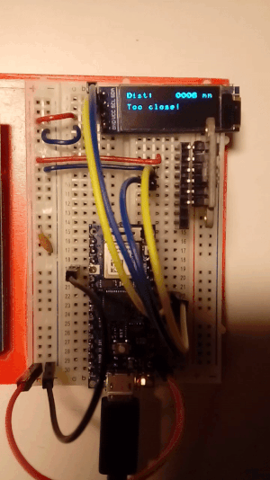

# Time of Flight sensor

Testing STM VL53L0X time-of-flight sensor with Rust, ported to Arduino Nano 33 IoT board. 
It keeps reading the distance in single mode, and printing out to the OLED (SSD1306) in Terminal Mode.
If the distance is below 100 mm, the built-in LED is turned on and a message "Too close!" is displayed.

TO DO:
* use a timer to trigger measurements

NOTES:
* because of how the Terminal Mode works, to keep the right number of characters in the buffer the numeric value needs leading zeros.